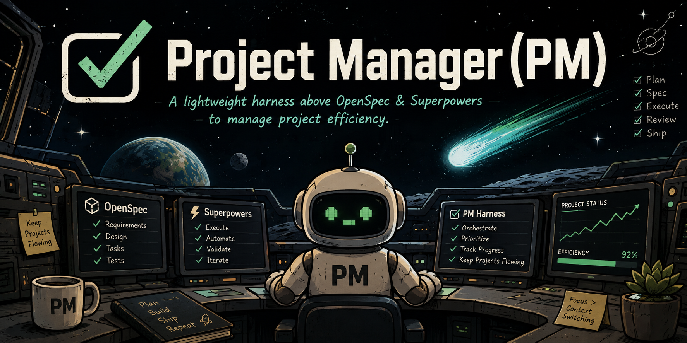

<p align="center">
  
</p>

<p align="center">
  <a href="https://github.com/cfdude/pm/actions/workflows/ci.yml"></a>
  <a href="https://github.com/cfdude/pm/actions/workflows/security.yml"></a>
  <a href="https://github.com/cfdude/pm/blob/main/.claude-plugin/plugin.json"></a>
  <a href="./LICENSE"></a>
</p>

# Project Manager (PM)

**A lightweight harness above [OpenSpec](https://github.com/Fission-AI/OpenSpec) and
[Superpowers](https://github.com/obra/superpowers) that keeps a Claude Code project on track —
across detours, context compaction, and however many epics are in flight at once.**

It answers the three questions you lose the moment context gets compacted or an interrupt
derails the session:

1. What were we working on before the detour?
2. What work is currently outstanding?
3. What is the next highest-priority item?

It does this **without becoming a second task tracker**. Stories stay wherever they already
live — OpenSpec `tasks.md`, a Superpowers plan, an external issue tracker. PM owns only what
none of those own: cross-epic **priority/ordering**, an explicit **detour stack**, and **epic
links** — including the reconcile relationship where a detour can invalidate the proposal it
interrupted.

When an epic has children, PM doubles as a **multi-agent harness**: a parent epic's children
run as worktree-isolated, unattended agents converging their work back through sequential
merge — not a metaphor, an actual dispatch-and-converge framework (see `/pm:hierarchy` under
[Commands](#commands) below).

## Why Use Project Manager (PM)?

Not a benchmark — real numbers pulled straight from this repo's own history, verifiable in
`git log`:

- Every multi-agent hierarchy dispatch runs **worktree-isolated**, unattended, converging back
  through sequential merge with **zero data loss** — every conflict seen so far has been
  mechanical (a shared CHANGELOG header, a usage string), never a real logic collision.
- **34 releases** shipped end-to-end (spec → build → test → changelog → version bump → release)
  with the plugin managing its own backlog the entire time.
- **235 tests**, **0 dependencies** — the entire engine (`scripts/conductor.mjs`) is Node 18+
  built-ins only, ~2,400 lines, nothing to `npm install`.
- Caught its own bugs mid-flight, live: a stale-cache silent fallback, an archived-child leak in
  hierarchy planning, a false-positive auto-detour heuristic — each found by using the tool on
  itself, logged as a `DF-` finding, and fixed in the same session it was discovered.

If you're managing more than one epic at a time, resuming work after a context compaction, or
running unattended multi-epic batches — this is the layer that remembers what OpenSpec and
Superpowers can't.

> [!IMPORTANT]
> **0.14.0** — `/pm:feedback` (file a bug/feature request as a GitHub issue directly from a
> session), `github-issues` tracker inward sync (pull open issues in as untriaged epics), and a
> CI workflow gating every PR.
>
> **0.13.0** — Worktree-isolated epic-hierarchy dispatch matures: category-based
> `--preauthorize` shorthand, per-epic review-mode escalation, auto-detected minimal detours
> from commit shape, dependency-aware top-level queue ordering, and a reconciler that writes
> its verdict back durably instead of leaving it in the transcript.
>
> See [CHANGELOG.md](CHANGELOG.md) for the full history.

## From Industry-Frontier Practice

PM's design choices aren't novel in isolation — they're borrowed, deliberately, from patterns
that already work at scale elsewhere and adapted to an agentic coding session:

- **Policy-as-code, not policy-as-prose** — `/pm:gate-guard`'s reconcile-owed check is a
  mechanical `PreToolUse` hook, not a rule an agent might forget to re-read after compaction.
  Same idea as an admission controller: the guard blocks the write, it doesn't just ask nicely.
- **Worktree isolation for parallel execution** — epic-hierarchy dispatch runs each child in
  its own git worktree/branch, merges sequentially, and treats the orchestrator as the sole
  writer of shared state — the same shape as isolating parallel CI jobs so they can't stomp on
  each other's output, applied to parallel *agent* execution instead.
- **An explicit interrupt stack, not implicit memory** — the detour stack (PUSH/POP + a
  mandatory reconcile gate on resume) is the same discipline as saving and restoring context
  around a hardware interrupt: the thing that got interrupted doesn't get to just "remember" —
  it gets re-validated before it resumes.
- **Instruction layer, never integration layer** — the engine never opens a network
  connection or calls an external system itself (the one documented exception is the opt-in
  gate-guard hook). External work — GitHub, Jira, Honcho — is always the interactive agent's
  job; the engine only shapes the instructions it emits. Same separation of concerns as a
  scheduler that never touches the resources it schedules.

## What You Can Learn

- **How to make a detour genuinely resumable** — not "remember to come back to this," but a
  structured stack frame with a reason, a link, and a mandatory reconcile gate that a fresh
  agent can re-run cold.
- **How to run multiple epics unattended without a shared-state race** — worktree isolation +
  sole-writer state transitions, discovered as a real gap during the plugin's own first live
  dogfood run (see the 0.12.0 changelog entry) and fixed the way you'd want any real bug fixed:
  in the open, with a design doc, not silently patched over.
- **How to keep a hard architectural law honest** — "the engine never calls an external
  system" is enforced by review discipline, not a technical sandbox, and the CLAUDE.md
  constraints spell out exactly the one documented exception and why.
- **How to turn a preflight scan into a real safety mechanism** — epic-level autonomy's
  decision rule (pre-authorized → proceed; no backup path → hard stop; destructive-but-
  restorable → warn and log; genuine unknown → stop) is designed to be followed by an agent
  mid-task, not just read once at the start.
- **How doc drift actually gets caught** — not by discipline alone (that already failed twice
  this session), but by treating a mismatch between a dispatch table and its own docs as a
  bug with a filed epic, the same as any other bug.

## Installation

Requirements: Node 18+ (already present via OpenSpec/Superpowers). No `npm install`, no other
dependencies — the engine is zero-dependency by hard rule.

This plugin is distributed via the `cfdude-plugins` marketplace:

```bash
/plugin marketplace add cfdude/cfdude-plugins
/plugin install pm@cfdude-plugins
```

### The Perfect Quartet

PM works completely on its own — install it and `/pm:init` gives you cross-epic priority
ordering, an explicit detour stack, and the reconcile gate, with no other plugin required.

That said, PM was designed to sit **above** three companions, and each one adds something PM
doesn't do itself:

- **[OpenSpec](https://openspec.dev)** — the `openspec` lane's spec-driven proposal workflow
  (`proposal.md` / `design.md` / `tasks.md`). PM tracks the epic; OpenSpec owns *what* gets built
  and its durable spec record.
- **[Superpowers](https://github.com/obra/superpowers)** — the `superpowers` lane's execution
  discipline (brainstorming, TDD, subagent-driven development, code review). PM tracks *when*
  and *in what order*; Superpowers drives *how well* each epic gets built.
- **[Honcho](https://docs.honcho.dev)** — durable memory that survives outside any single
  repo. PM's detour stack and reconcile gate are the *live working set* for one project; Honcho
  is where a PUSH/POP memory line goes so the relationship between projects — and between
  sessions of the same project — survives a context compaction, a new machine, or a week away.
  Genuinely useful the moment you're juggling more than one repo PM manages.

Install OpenSpec:

```bash
npm install -g @fission-ai/openspec   # or: brew install openspec
cd your-project
openspec init
```

Install Superpowers (available on the official Anthropic marketplace):

```bash
/plugin marketplace add anthropics/claude-plugins-official
/plugin install superpowers@claude-plugins-official
```

> [!TIP]
> **Honcho** is the one companion that's genuinely out of scope for a quick install block here —
> it's a full memory service, not a Claude Code plugin. Plastic Labs offers both a hosted
> option and self-hosted deployment; start at **[docs.honcho.dev](https://docs.honcho.dev)** for
> current setup instructions, or go straight to the source at
> **[github.com/plastic-labs/honcho](https://github.com/plastic-labs/honcho)**. Not required for
> PM to work — only recommended once you want a project's detour history to outlive that
> project's own context window.

## Quick Start

```bash
cd your-project
/pm:init
```

`/pm:init` scaffolds `.conductor/state.json`, registers any existing OpenSpec proposals and
Superpowers plans as epics, writes the managed rules block into your project's `CLAUDE.md`,
and renders `PROJECT.md`. From there:

```bash
/pm:status   # see the current briefing
/pm:next     # decide what to work on
```

## Supported Platforms

| Platform | Status | Notes |
|----------|--------|-------|
| Claude Code | ✅ Supported | The only platform PM runs on today — plugin commands, hooks, and skills all target it directly. |
| Codex | 🗺️ Planned | Tracked under `multi-platform-agent-support`. |
| Gemini CLI | 🗺️ Planned | Tracked under `multi-platform-agent-support`. |
| Grok Build (xAI) | 🗺️ Planned | Tracked under `multi-platform-agent-support`. |
| `AGENTS.md`-based platforms (generic) | 🗺️ Planned | Most non-Claude-Code tools use `AGENTS.md` instead of `CLAUDE.md` for project instructions — supporting that format is the shared unlock for all of the above. |

## External Trackers

PM can make a project *aware* that its epics mirror to an external issue tracker, without the
engine ever calling that tracker itself — same instruction-layer law as everything else. Works
generically with any tracker name (`--system` isn't an enum), so **Jira**, **Linear**, and
**GitHub Issues** are all supported today.

**Jira and Linear (and any other `--system`) get bidirectional mirroring:** the rules block
tells the agent to create a tracker issue for any local epic lacking `externalId`, then keep
its status transitioning in step with the linked issue.

**`github-issues` is deliberately INWARD-ONLY, not bidirectional:** open issues in the
configured repo get pulled in as untriaged epics (`gh issue list` → `add-epic --status
untriaged`, deduped by `externalId`), but the rules block does **not** tell the agent to
auto-create a GitHub issue for a local epic just because a `github-issues` tracker is
configured. Silently filing a public GitHub issue for every unmirrored claude-code epic is a
much bigger, more consequential default than mirroring toward an internal Jira/Linear
instance — so that outward instruction is suppressed specifically for `github-issues`, while
Jira/Linear keep the full bidirectional behavior unchanged.

Real shape, from a project actually running this in production:

```jsonc
"tracker": {
  "system": "jira",
  "instance": "your-jira-instance",
  "projectKey": "JOB",
  "mechanism": "mcp",
  "statusIntent": {
    "untriaged": "backlog",
    "queued": "todo",
    "active": "in-progress",
    "paused": "todo",
    "planned": "backlog",
    "archived": "done"
  }
}
```

`statusIntent` maps PM's lifecycle to a *semantic* target, never a literal workflow-transition
name — the interactive agent resolves the actual transition. An epic mirrored to that tracker
looks like:

```jsonc
{
  "id": "job-504",
  "title": "[JOB-504] Investigation: matching pipeline audit",
  "status": "archived",
  "lane": "external",
  "externalId": "JOB-504",
  "externalUrl": "https://your-instance.atlassian.net/browse/JOB-504"
}
```

Configure with `/pm:tracker` — it detects signals in your project, confirms with you, and
calls `set-tracker`. The briefing's `TRACKER SYNC` line only ever lists honestly-computable
drift (an active-work epic missing `externalId`); it never fabricates transition state the
engine can't actually see.

**Primary + secondary trackers:** a repo has exactly one **primary** tracker (everything above)
plus, optionally, one or more **secondary** trackers — for when your real dev tracker is Jira but
you also want to watch a GitHub repo for inbound issues, e.g. from outside contributors, or from
another internal repo publishing cross-project notifications (a service filing a GitHub issue in
a downstream repo to flag a breaking change). A secondary tracker gets inward pull (deduped by
`externalUrl`, which is globally unique, rather than bare `externalId`, which only has to be
unique within one tracker/repo — two secondary trackers can each have an issue numbered `#42`
without colliding) plus **completion status writeback**: when an epic sourced from a secondary
tracker reaches `archived`, the agent closes the linked issue there too. It never gets
outward-created issues — that stays exclusive to the primary tracker.

```bash
node "${CLAUDE_PLUGIN_ROOT}/scripts/conductor.mjs" set-tracker --system jira --project JOB
node "${CLAUDE_PLUGIN_ROOT}/scripts/conductor.mjs" set-tracker --role secondary \
  --system github-issues --repo acme/market-intelligence
```

See `commands/tracker.md` for the full `--role`/`--remove` contract.

**Resyncing after completion:** whenever an inward-pull-capable tracker is configured (a
`github-issues` primary, or any secondary tracker), the rules block instructs the agent to
re-sync with its tracker(s) (`/pm:sync`) right after closing/transitioning a linked issue as part
of completing an epic — the phrasing stays tracker-count-agnostic regardless of how many are
configured. The SessionStart brief also nudges toward `/pm:sync` whenever any tracker exists;
this is a non-blocking reminder only, never an automatic sync.

## Commands

<details>
<summary><code>/pm:init</code> — Initialize the PM conductor in this repo</summary>

Scaffolds `.conductor/state.json`, registers any existing OpenSpec proposals and Superpowers
plans as epics, writes the managed rules block into `CLAUDE.md`, and renders `PROJECT.md`.
Safe to run once per repo; re-running is a no-op if already initialized.

</details>

<details>
<summary><code>/pm:status</code> — Show the current conductor briefing</summary>

The active epic (with lane), the detour stack, the top-priority epics next up, and per-lane
counts. Re-renders `PROJECT.md` from `.conductor/state.json` first.

</details>

<details>
<summary><code>/pm:next</code> — Decide what to work on next</summary>

Resumes the top of the detour stack if non-empty; otherwise picks the highest-priority
`queued` epic (P0→P3), skipping anything starved on an unresolved `depends-on` link and
naming the blocker when it does.

</details>

<details>
<summary><code>/pm:detour [what came up]</code> — Handle a mid-build interruption</summary>

Classifies the interruption as minimal or substantial before doing anything else.

| Flag | Behavior |
|------|----------|
| `--minimal "<what you fixed>"` | Fast-path: calls `log-detour` to append to `.conductor/detours.log` and resume. No proposal, no stack entry. |
| _(none)_ | Substantial: PUSH the current epic onto the detour stack, spin up a new epic in the appropriate lane for the detour. |

`honcho-memory <push\|pop> <epicId> "<reason>"` formats the exact ready-to-copy Honcho memory
line for a PUSH/POP and appends a timestamped copy to `.conductor/honcho-memories.log` — the
engine only formats and logs the string, it never calls Honcho itself.

</details>

<details>
<summary><code>/pm:resume</code> — Resume a paused epic after a detour</summary>

Pops the detour stack and runs the mandatory **reconcile gate**: a fresh-context `reconciler`
agent re-validates the paused epic against what the detour actually shipped, then writes its
verdict back durably via `record-reconcile` (not just into the conversation transcript).

</details>

<details>
<summary><code>record-gate-review &lt;epicId&gt; --gate 1|2 --verdict pass|fail [--reviewer "&lt;note&gt;"]</code> — Record an OpenSpec gate review</summary>

Writes a fresh-context reviewer's verdict durably onto an `openspec`-lane epic
(`gateReview.gate1`/`gate2`). `update-epic --status archived` **rejects** the transition for any
`openspec`-lane epic that doesn't already have a recorded `gateReview.gate2.verdict === "pass"` —
Gate 2 (implementation review, before docs) is mechanically required to archive, not just
narrated. Scoped strictly to the `openspec` lane; `superpowers`/`claude-code`/`decision`/`external`
epics are completely unaffected.

</details>

<details>
<summary><code>/pm:sync</code> — Register new proposals and plans</summary>

Picks up any new OpenSpec proposals or Superpowers plans not yet tracked as epics. When a
`github-issues` tracker is configured, also pulls open issues in as untriaged epics
(deduplicated by `externalId`).

</details>

<details>
<summary><code>/pm:epic</code> — Register or manage an epic directly</summary>

| Subcommand | Does |
|------------|------|
| `add --id X --title "…" --lane L --priority P [--status S] [--parent ID] [--external-id KEY]` | Register any epic in any lane; optionally nest under a parent or link a tracker issue. |
| `add-many --from <path\|->` | Atomically bulk-create a parent + children from a JSON batch. |
| `update-epic <id> [--title …] [--status …] [--parent …] [--link …] [--review-mode …]` | Write-back path — title corrections, status changes, links, per-epic review-mode escalation. |
| `remove-epic <id> [--cascade]` | Hard-delete; blocked by default if it has children (`--cascade` removes descendants too). Strips dangling links elsewhere. |
| `set-active <id>` / `clear-active` | Set/clear the top-level active epic. |

</details>

<details>
<summary><code>/pm:hierarchy</code> — Run a parent epic's children as a batched, unattended multi-agent harness</summary>

`plan-hierarchy --parent <id>` computes execution batches from `priority` + sibling
`depends-on` links (topological sort, cycle-rejecting). Dispatch is worktree-isolated: each
child runs as its own agent in its own git worktree/branch, never writes
`.conductor/state.json` itself, and converges back sequentially with the orchestrator as sole
writer of state transitions. An ordinary merge conflict is never a hard stop — it resolves via
a tiered ladder before ever reaching "ask the human."

</details>

<details>
<summary><code>set-autonomy &lt;id&gt;</code> — Grant an epic broad execution trust</summary>

Only after a mandatory preflight risk-scan (full read of the epic's source, not a keyword
grep). See the `conductor` skill's "Epic-level autonomy" section for the full process.

| Flag | Does |
|------|------|
| `--level off\|autonomous` | The trust level itself. |
| `--preauthorize "<action>:<reason>"` | Pre-approve one specific action (repeatable). |
| `--preauthorize "category:<name>:<reason>"` | Pre-approve a whole class of routine actions (`filesystem`, `network`, `schema`, `external-api`) without enumerating each one. |
| `--context "<note>"` | Record background/decisions supplied during preflight (repeatable). |
| `--notify "<what>"` | Durably record a WARN-class decision as it happens, not just for an end-of-epic report. |

</details>

<details>
<summary><code>/pm:review-mode</code> — Set this repo's review-intensity dial</summary>

`set-review-mode --mode off|standard|thorough`: `off` (self-review only) · `standard`
(default — one fresh-context reviewer per gate) · `thorough` (two independent reviewers,
adjudicated). A single epic can escalate above the repo's dial via `update-epic <id>
--review-mode`, but never de-escalate below it.

</details>

<details>
<summary><code>/pm:gate-guard</code> — Inspect the reconcile-gate guard</summary>

A hard `PreToolUse` guard blocking `Edit`/`Write`/`NotebookEdit` while the active epic still
owes a reconcile — **on by default and unconditional** for that specific case; `set-gate-guard
off` no longer bypasses it.

</details>

<details>
<summary><code>/pm:lane-routing</code> — Per-repo lane-routing overrides</summary>

`set-lane-routing --add "<match>:<lane>" [--add …] | --remove "<match>" | --clear` defines
keyword/glob rules checked before the generic lane heuristic — for when "anything touching
billing always goes through openspec" needs to be a rule, not a CLAUDE.md carve-out.
`suggest-lane "<free text>"` looks one up.

</details>

<details>
<summary><code>/pm:tracker</code> — Make the conductor aware of an external issue tracker</summary>

Detects signals, confirms with you, and records the tracker (Jira/GitHub/Linear) — the engine
never calls the tracker itself; it only shapes the instructions it emits for you to act on.

</details>

<details>
<summary><code>/pm:feedback</code> — File a bug report or feature request</summary>

`/pm:feedback [bug|feature] "<summary>"` posts directly as a GitHub issue on `cfdude/pm` —
searches for a near-duplicate first (comments instead of filing a new issue on a match). All
`gh` calls are agent-invoked; the engine itself never touches GitHub.

The CLAUDE.md rules block includes an unconditional "Feedback" section encouraging the agent
to use this proactively — file a bug/limitation/friction point (or ask "want me to file this
as feedback?") instead of silently working around it. Recurring friction that never gets
reported is a product failure the same way a crash is; this section exists because that
happened here for real (see `df-update-epic-no-story-toggle-verb`).

</details>

<details>
<summary><code>/pm:changelog</code> — Show what changed in the plugin</summary>

The changelog delta between this repo's stamped `pmVersion` and the currently installed
version.

</details>

<details>
<summary><code>/pm:upgrade</code> — Upgrade this repo's conductor state/rules</summary>

Refreshes the `CLAUDE.md` rules block (`write-rules`), runs any pending migrations,
re-renders `PROJECT.md`, and stamps the new `pmVersion`. Idempotent — safe to run more than
once. Requires `/reload-plugins` first if you just updated the plugin (the SessionStart
briefing tells you when).

After showing the changelog delta ("What's new in pm"), the agent reviews each `Added`
headline and recommends adopting any opt-in capability that's relevant to this repo's current
`.conductor/state.json` (e.g. secondary trackers, `thorough` review mode) — one line, one
reason, the command to run. It never enables anything itself.

</details>

<details>
<summary><code>verify-state</code> — Detect an undetected hand-edit of state.json</summary>

Compares `state.json`'s filesystem mtime against the timestamp recorded at the last
`render()`. Fails loudly (non-zero exit) if `state.json` was modified after the last render —
mechanical evidence of a hand-edit, which is against the rules (`state.json` should only
change through the engine's own subcommands).

</details>

<details>
<summary><code>changesets</code> — List pending CHANGELOG fragment files</summary>

Lists every `.changesets/*.md` fragment as `{ changesets: [{ id, path, body }] }`, sorted by
epic id. Hierarchy children write their changelog entry to `.changesets/<epic-id>.md` instead
of editing `CHANGELOG.md`'s shared `[Unreleased]` section directly — eliminating the merge
conflict that section otherwise guarantees across parallel batches. The orchestrator remains
the sole writer of `CHANGELOG.md`, consolidating pending fragments into it once at release
time, then deleting the consumed fragment files.

</details>

## Skills

Installed to `skills/` on `/pm:init`:

| Skill | Description |
|-------|-------------|
| `conductor` | The full discipline — detour classification, PUSH/POP, the reconcile gate, epic-level autonomy's preflight scan, epic-hierarchy orchestration. Triggers on "what were we working on," "this is broken, fix it first," "park this," "resume." |

## Guard & Automation

<details>
<summary>View hooks and agents</summary>

**Hooks** (`hooks/hooks.json`) — dormant until `/pm:init` runs in a project:

| Hook | Purpose |
|------|---------|
| SessionStart (startup / resume / **compact**) | Injects the briefing via `additionalContext` — the index comes back the moment context is summarized away. |
| PreCompact | Calls `snapshot` (`render` + `.conductor/brief.txt`) right before the context window collapses. |
| PostToolUse (`git commit`) | Calls `commit-nudge`: nudges a state update after every commit; also auto-detects an unlogged minimal detour from commit shape (excluding routine conductor bookkeeping commits). |
| PreToolUse (gate-guard) | Hard-blocks `Edit`/`Write`/`NotebookEdit` while the active epic owes a reconcile — on by default, unconditional for that case. |

**Agents** (`agents/`) — dispatched by name, run in a clean context:

| Agent | Purpose |
|-------|---------|
| `reconciler` | Fresh-context re-validation of a paused epic against what a detour actually shipped, at the reconcile gate. |
| `hierarchy-child-executor` | Executes one child epic from a hierarchy batch, front-loaded with its autonomy grant, in its own worktree. |
| `merge-conflict-resolver` | Second rung of the tiered conflict-resolution ladder — resolves a worktree-merge conflict after a normal `git merge` fails. |

</details>

## Workflow

```
/pm:init  →  /pm:status  →  /pm:next  →  (build the epic in its own lane)  →  /pm:sync
                 ↑                              │
                 └────── /pm:detour ────────────┤
                         (minimal: fix→commit→push→log, resume)
                         (substantial: PUSH → build detour → /pm:resume → RECONCILE GATE → POP)
```

Multi-epic batches: `plan-hierarchy --parent <id>` → dispatch each child (worktree-isolated) →
merge sequentially → orchestrator applies all state transitions as sole writer →
`verify-worktrees` for hygiene.

## Project Structure

```
your-project/
├── .conductor/
│   ├── state.json           # state of record — epics, detour stack, links, autonomy grants
│   ├── detours.log          # append-only trail: timestamp · SHA · kind · epic · note
│   └── honcho-memories.log  # ready-to-copy Honcho memory lines, timestamped
├── CLAUDE.md                # managed rules block (idempotent; delete to opt out)
└── PROJECT.md               # generated view — never hand-edited

pm/ (this repo)
├── .claude-plugin/plugin.json   manifest
├── CHANGELOG.md                 release history (Keep a Changelog + SemVer)
├── commands/                    /pm:init /pm:status /pm:next /pm:detour /pm:resume /pm:sync
│                                 /pm:epic /pm:hierarchy /pm:tracker /pm:feedback /pm:lane-routing
│                                 /pm:review-mode /pm:gate-guard /pm:changelog /pm:upgrade
├── skills/conductor/SKILL.md    the discipline
├── agents/                      reconciler.md · hierarchy-child-executor.md · merge-conflict-resolver.md
├── hooks/hooks.json             SessionStart · PreCompact · PostToolUse · PreToolUse
└── scripts/conductor.mjs        the engine (zero dependencies)
```

## Development

See [CONTRIBUTING.md](CONTRIBUTING.md) for the dev/main branch workflow, PR requirements, and
CI gate. See [CHANGELOG.md](CHANGELOG.md) for version history.

## Roadmap

Tracked in this repo's own conductor backlog (`PROJECT.md`) rather than a separate board —
`pm` manages its own development. Notable planned items: multi-platform agent support
(Codex, Gemini CLI, Grok Build, generic `AGENTS.md`), an AI feedback loop closing the
`/pm:feedback` ↔ issue-sync cycle, and portfolio-level architecture-consistency scanning
across the backlog.

## Star History

<a href="https://www.star-history.com/?type=date&repos=cfdude%2Fpm">
 <picture>
   <source media="(prefers-color-scheme: dark)" srcset="https://api.star-history.com/chart?repos=cfdude/pm&type=date&theme=dark&legend=top-left&sealed_token=4X1EU7rFhQQ8LKD7ppmOfK_dPmH8T8SNBGsbYUd4JUTNhwsa5mHKztQ4ZyOphe1HW_6iQUMa2W3RKvMEbEINz3tBrF8nZ-cAWbQ-JSz8e3lzxtD6QhN2Af29fc8SGZ0GqkDS4zzknNFpzybw2u1a7RXnzd6MDT2_jEL_jLqP9TaCsNOhQ_iUbXvoLvW9" />
   <source media="(prefers-color-scheme: light)" srcset="https://api.star-history.com/chart?repos=cfdude/pm&type=date&legend=top-left&sealed_token=4X1EU7rFhQQ8LKD7ppmOfK_dPmH8T8SNBGsbYUd4JUTNhwsa5mHKztQ4ZyOphe1HW_6iQUMa2W3RKvMEbEINz3tBrF8nZ-cAWbQ-JSz8e3lzxtD6QhN2Af29fc8SGZ0GqkDS4zzknNFpzybw2u1a7RXnzd6MDT2_jEL_jLqP9TaCsNOhQ_iUbXvoLvW9" />
   
 </picture>
</a>

## License

MIT © Rob Sherman
