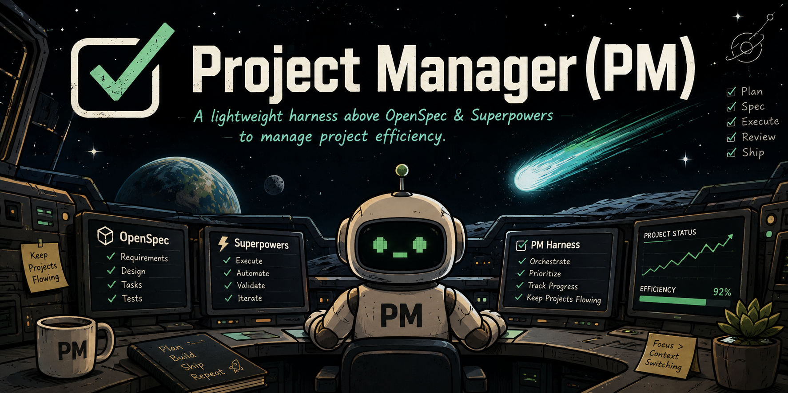

<p align="center">
  
</p>

<p align="center">
  <a href="https://github.com/cfdude/pm/actions/workflows/ci.yml"></a>
  <a href="https://github.com/cfdude/pm/actions/workflows/security.yml"></a>
  <a href="https://github.com/cfdude/pm/blob/main/.claude-plugin/plugin.json"></a>
  <a href="./LICENSE"></a>
</p>

# Project Manager (PM)

**A lightweight harness above [OpenSpec](https://github.com/Fission-AI/OpenSpec) and
[Superpowers](https://github.com/obra/superpowers) that keeps a Claude Code project on track —
across detours, context compaction, and however many epics are in flight at once.**

Full documentation lives at [pm-plugin.dev](https://pm-plugin.dev). For AI agents: the site
publishes [`llms.txt`](https://pm-plugin.dev/llms.txt) (a lightweight, ~7KB index of every doc
page) and [`llms-full.txt`](https://pm-plugin.dev/llms-full.txt) (the entire site as one
document, ~200KB — use sparingly, not as a default).

It answers the three questions you lose the moment context gets compacted or an interrupt
derails the session:

1. What were we working on before the detour?
2. What work is currently outstanding?
3. What is the next highest-priority item?

It does this **without becoming a second task tracker**. Stories stay wherever they already
live — OpenSpec `tasks.md`, a Superpowers plan, an external issue tracker. PM owns only what
none of those own: cross-epic **priority/ordering**, an explicit **detour stack**, and **epic
links** — including the reconcile relationship where a detour can invalidate the proposal it
interrupted.

When an epic has children, PM doubles as a **multi-agent harness**: a parent epic's children
run as worktree-isolated, unattended agents converging their work back through sequential
merge — not a metaphor, an actual dispatch-and-converge framework (see `/pm:hierarchy` under
[Commands](#commands) below).

## Why Use Project Manager (PM)?

Not a benchmark — real numbers pulled straight from this repo's own history, verifiable in
`git log`:

- Every multi-agent hierarchy dispatch runs **worktree-isolated**, unattended, converging back
  through sequential merge with **zero data loss** — every conflict seen so far has been
  mechanical (a shared CHANGELOG header, a usage string), never a real logic collision.
- **43 releases** shipped end-to-end (spec → build → test → changelog → version bump → release)
  with the plugin managing its own backlog the entire time.
- **603 tests**, **0 dependencies** — the entire engine is Node 18+ built-ins only, ~6,000 lines
  across a 174-line `scripts/conductor.mjs` entry point and 32 `scripts/lib/*.mjs` modules,
  nothing to `npm install`. The suite itself is split across 18 files so it runs in parallel.
- Caught its own bugs mid-flight, live: a stale-cache silent fallback, an archived-child leak in
  hierarchy planning, a false-positive auto-detour heuristic — each found by using the tool on
  itself, logged as a `DF-` finding, and fixed in the same session it was discovered.

If you're managing more than one epic at a time, resuming work after a context compaction, or
running unattended multi-epic batches — this is the layer that remembers what OpenSpec and
Superpowers can't.

> [!IMPORTANT]
> **0.14.0** — `/pm:feedback` (file a bug/feature request as a GitHub issue directly from a
> session), `github-issues` tracker inward sync (pull open issues in as untriaged epics), and a
> CI workflow gating every PR.
>
> **0.13.0** — Worktree-isolated epic-hierarchy dispatch matures: category-based
> `--preauthorize` shorthand, per-epic review-mode escalation, auto-detected minimal detours
> from commit shape, dependency-aware top-level queue ordering, and a reconciler that writes
> its verdict back durably instead of leaving it in the transcript.
>
> See [CHANGELOG.md](CHANGELOG.md) for the full history.

## From Industry-Frontier Practice

PM's design choices aren't novel in isolation — they're borrowed, deliberately, from patterns
that already work at scale elsewhere and adapted to an agentic coding session:

- **Policy-as-code, not policy-as-prose** — `/pm:gate-guard`'s reconcile-owed check is a
  mechanical `PreToolUse` hook, not a rule an agent might forget to re-read after compaction.
  Same idea as an admission controller: the guard blocks the write, it doesn't just ask nicely.
- **Worktree isolation for parallel execution** — epic-hierarchy dispatch runs each child in
  its own git worktree/branch, merges sequentially, and treats the orchestrator as the sole
  writer of shared state — the same shape as isolating parallel CI jobs so they can't stomp on
  each other's output, applied to parallel *agent* execution instead.
- **An explicit interrupt stack, not implicit memory** — the detour stack (PUSH/POP + a
  mandatory reconcile gate on resume) is the same discipline as saving and restoring context
  around a hardware interrupt: the thing that got interrupted doesn't get to just "remember" —
  it gets re-validated before it resumes.
- **Instruction layer, never integration layer** — the engine never opens a network
  connection or calls an external system itself (the one documented exception is the opt-in
  gate-guard hook). External work — GitHub, Jira, Honcho — is always the interactive agent's
  job; the engine only shapes the instructions it emits. Same separation of concerns as a
  scheduler that never touches the resources it schedules.

## What You Can Learn

- **How to make a detour genuinely resumable** — not "remember to come back to this," but a
  structured stack frame with a reason, a link, and a mandatory reconcile gate that a fresh
  agent can re-run cold.
- **How to run multiple epics unattended without a shared-state race** — worktree isolation +
  sole-writer state transitions, discovered as a real gap during the plugin's own first live
  dogfood run (see the 0.12.0 changelog entry) and fixed the way you'd want any real bug fixed:
  in the open, with a design doc, not silently patched over.
- **How to keep a hard architectural law honest** — "the engine never calls an external
  system" is enforced by review discipline, not a technical sandbox, and the CLAUDE.md
  constraints spell out exactly the one documented exception and why.
- **How to turn a preflight scan into a real safety mechanism** — epic-level autonomy's
  decision rule (pre-authorized → proceed; no backup path → hard stop; destructive-but-
  restorable → warn and log; genuine unknown → stop) is designed to be followed by an agent
  mid-task, not just read once at the start.
- **How doc drift actually gets caught** — not by discipline alone (that already failed twice
  this session), but by treating a mismatch between a dispatch table and its own docs as a
  bug with a filed epic, the same as any other bug.

## Installation

Requirements: Node 18+ (already present via OpenSpec/Superpowers). No `npm install`, no other
dependencies — the engine is zero-dependency by hard rule.

This plugin is distributed via the `cfdude-plugins` marketplace:

```bash
/plugin marketplace add cfdude/cfdude-plugins
/plugin install pm@cfdude-plugins
```

### The Perfect Quartet

PM works completely on its own — install it and `/pm:init` gives you cross-epic priority
ordering, an explicit detour stack, and the reconcile gate, with no other plugin required.

That said, PM was designed to sit **above** three companions, and each one adds something PM
doesn't do itself:

- **[OpenSpec](https://openspec.dev)** — the `openspec` lane's spec-driven proposal workflow
  (`proposal.md` / `design.md` / `tasks.md`). PM tracks the epic; OpenSpec owns *what* gets built
  and its durable spec record.
- **[Superpowers](https://github.com/obra/superpowers)** — the `superpowers` lane's execution
  discipline (brainstorming, TDD, subagent-driven development, code review). PM tracks *when*
  and *in what order*; Superpowers drives *how well* each epic gets built.
- **[Honcho](https://docs.honcho.dev)** — durable memory that survives outside any single
  repo. PM's detour stack and reconcile gate are the *live working set* for one project; Honcho
  is where a PUSH/POP memory line goes so the relationship between projects — and between
  sessions of the same project — survives a context compaction, a new machine, or a week away.
  Genuinely useful the moment you're juggling more than one repo PM manages.

Install OpenSpec:

```bash
npm install -g @fission-ai/openspec   # or: brew install openspec
cd your-project
openspec init
```

Install Superpowers (available on the official Anthropic marketplace):

```bash
/plugin marketplace add anthropics/claude-plugins-official
/plugin install superpowers@claude-plugins-official
```

> [!TIP]
> **Honcho** is the one companion that's genuinely out of scope for a quick install block here —
> it's a full memory service, not a Claude Code plugin. Plastic Labs offers both a hosted
> option and self-hosted deployment; start at **[docs.honcho.dev](https://docs.honcho.dev)** for
> current setup instructions, or go straight to the source at
> **[github.com/plastic-labs/honcho](https://github.com/plastic-labs/honcho)**. Not required for
> PM to work — only recommended once you want a project's detour history to outlive that
> project's own context window.

## Quick Start

```bash
cd your-project
/pm:init
```

`/pm:init` scaffolds `.conductor/state.json`, registers any existing OpenSpec proposals and
Superpowers plans as epics, writes the managed rules block into your project's `CLAUDE.md`
(or the equivalent file for a declared non-Claude-Code platform — see Supported Platforms),
and renders `PROJECT.md`. From there:

```bash
/pm:status   # see the current briefing
/pm:next     # decide what to work on
```

## Supported Platforms

The host declares which platform it is via `--platform <claude-code|hermes|codex>` in the hook
command pm authors for that platform (unrecognized values are rejected, not silently defaulted).
The declared platform is recorded in `.conductor/state.json` by `/pm:init` and `write-rules` —
the commands that accept the flag and (re)write the block. The read-only hooks pass it through
without persisting, and `/pm:upgrade` does not read it either (its `0.24.0` migration stamps
`claude-code` on repos that predate the field, rather than adopting a declared value). The
recorded platform shapes two things: the command
form written into the managed rules block (`/pm:status` on Claude Code and Hermes, `/pm-status`
on Codex — Hermes keeps the `pm:` namespace because it silently skips a plugin command that
collides with one of its built-ins, and it ships a built-in `status`), and which file the block
is written to, first-match-wins over that platform's own project-context precedence chain
(`CLAUDE.md` for Claude Code; `HERMES.md` > `AGENTS.md` > `CLAUDE.md` for Hermes; `AGENTS.md` for
Codex, which cannot read `CLAUDE.md` at all).

| Platform | Status | Notes |
|----------|--------|-------|
| Claude Code | ✅ Supported | The only platform PM actually *runs* on today — plugin commands, hooks, and skills all target it directly. |
| Hermes | 🗺️ Rules block only | pm renders a correctly-targeted, correctly-worded rules block (`--platform hermes`) but ships no Hermes commands/hooks yet. Tracked under `multi-platform-agent-support`. |
| Codex | 🗺️ Rules block only | Same — `--platform codex` writes `AGENTS.md` with the flat `/pm-status` command form, but no Codex prompt files ship yet. Tracked under `multi-platform-agent-support`. |
| Gemini CLI | 🗺️ Planned | Tracked under `multi-platform-agent-support`. |
| Grok Build (xAI) | 🗺️ Planned | Tracked under `multi-platform-agent-support`. |
| `AGENTS.md`-based platforms (generic) | 🗺️ Planned | Most non-Claude-Code tools use `AGENTS.md` instead of `CLAUDE.md` for project instructions — supporting that format is the shared unlock for all of the above. |

## External Trackers

PM can make a project *aware* that its epics mirror to an external issue tracker, without the
engine ever calling that tracker itself — same instruction-layer law as everything else. Works
generically with any tracker name (`--system` isn't an enum), so **Jira**, **Linear**, and
**GitHub Issues** are all supported today.

### Direction is configuration, not a vendor rule

**⚠️ Behavior change in 0.27.0.** Direction used to be inferred from the vendor —
`github-issues` was hardcoded inward-only and every other system got the outward mirror. It is
now an explicit `direction` on the tracker entry, and that recorded value is what every emitter
reads:

| `direction` | The rules block and the brief tell the agent to… |
|-------------|--------------------------------------------------|
| `inward` | list open items in the tracker's scope and register the new ones with `add-epic --status untriaged` (deduped by `externalUrl`), using the deterministic `--id` the emitted recipe supplies |
| `outward` | create a tracker issue for any local epic lacking `externalId`, then keep its status transitioning in step with the linked issue |
| `both` | do both |

**A NEW primary tracker registered without `--direction` now defaults to `inward`, whatever the
vendor.** This is a deliberate reversal: `set-tracker --system jira --project JOB` produced the
outward mirror in 0.26.0 and produces the inward pull in 0.27.0. Outward creation of issues in
someone else's tracker is the consequential default and has to be chosen, not inherited. The
one-line remedy, if outward is what you want:

```bash
node "${CLAUDE_PLUGIN_ROOT}/scripts/conductor.mjs" set-tracker --system jira --direction outward
```

**Existing repos are unaffected.** `/pm:upgrade` stamps each tracker with the direction it
already behaves with — `github-issues` primary → `inward`, any other primary → `outward`, every
secondary → `inward` — and an explicitly set value is never overwritten, so a second upgrade is a
no-op. A secondary tracker is pinned to `inward`; any other value is rejected, because a secondary
is pull-plus-writeback by definition and has never created anything outward.

Direction alone does not turn a section on: an inward section is emitted only when the tracker
also names **what to read**. A `github-issues` tracker with no `repo` still emits neither section,
because pm may not emit a command line with an unfilled placeholder.

Real shape, from a project actually running this in production:

```jsonc
"tracker": {
  "system": "jira",
  "instance": "your-jira-instance",
  "projectKey": "JOB",
  "mechanism": "mcp",
  "statusIntent": {
    "untriaged": "backlog",
    "queued": "todo",
    "active": "in-progress",
    "paused": "todo",
    "planned": "backlog",
    "archived": "done"
  }
}
```

`statusIntent` maps PM's lifecycle to a *semantic* target, never a literal workflow-transition
name — the interactive agent resolves the actual transition. An epic mirrored to that tracker
looks like:

```jsonc
{
  "id": "job-504",
  "title": "[JOB-504] Investigation: matching pipeline audit",
  "status": "archived",
  "lane": "external",
  "externalId": "JOB-504",
  "externalUrl": "https://your-instance.atlassian.net/browse/JOB-504"
}
```

Configure with `/pm:tracker` — it detects signals in your project, confirms with you, and
calls `set-tracker`. The briefing's `TRACKER SYNC` line only ever lists honestly-computable
drift (an active-work epic missing `externalId`); it never fabricates transition state the
engine can't actually see.

**Primary + secondary trackers:** a repo has exactly one **primary** tracker (everything above)
plus, optionally, one or more **secondary** trackers — for when your real dev tracker is Jira but
you also want to watch a GitHub repo for inbound issues, e.g. from outside contributors, or from
another internal repo publishing cross-project notifications (a service filing a GitHub issue in
a downstream repo to flag a breaking change). A secondary tracker gets inward pull (deduped by
`externalUrl`, which is globally unique, rather than bare `externalId`, which only has to be
unique within one tracker/repo — two secondary trackers can each have an issue numbered `#42`
without colliding) plus **completion status writeback**: when an epic sourced from a secondary
tracker reaches `archived`, the agent closes the linked issue there too. It never gets
outward-created issues — that stays exclusive to the primary tracker.

```bash
node "${CLAUDE_PLUGIN_ROOT}/scripts/conductor.mjs" set-tracker --system jira --project JOB
node "${CLAUDE_PLUGIN_ROOT}/scripts/conductor.mjs" set-tracker --role secondary \
  --system github-issues --repo acme/market-intelligence
```

See `commands/tracker.md` for the full `--role`/`--remove` contract.

**Resyncing after completion:** where at least one configured tracker has an **emittable inward
procedure** — direction includes `inward` *and* it names a scope to read — the rules block
instructs the agent to re-sync (`/pm:sync`) right after closing/transitioning a linked issue as
part of completing an epic. The phrasing stays tracker-count-agnostic regardless of how many are
configured. The SessionStart brief nudges toward `/pm:sync` on the same condition; it is a
non-blocking reminder, never an automatic sync.

> **Changed in 0.27.0.** Both of those used to fire more widely: the reminder appeared in every
> rules block with a tracker (citing "the writeback steps above" that the same block never
> emitted), and the brief's nudge appeared whenever any tracker existed. An outward-only repo now
> gets neither. If you are diffing 0.27.0's emitted output against 0.26.0's, these are two of
> exactly three expected differences — the third is progress rendering `· N lifecycle`. Treat a
> fourth as a regression.

**Freshness and the refresh gate:** a tracker-linked epic carries `externalUpdatedAt`, the
**tracker's own** updated timestamp as of the last time the agent actually read that item. Before
an epic becomes the active piece of work its source of truth is re-read, and the obligation is
cleared by `record-tracker-refresh`. The gate keys on **provenance** — does this epic have an
external origin — never on direction: an issue filed by a third party and an epic born from a
local spec have different sources of truth in the same repo on the same day.

The brief's freshness line — `⚠ N tracker-linked epic(s) never re-read since mirroring` — counts
only epics that can still become work: every `archived` epic is excluded, because the **archive
disposition discharges the refresh obligation outright**, whatever the outcome. There is no
terminal watermark to record. The closed half stays the agent's: the engine cannot know a tracker
item is closed without integration it must never do, so the inward-sync step that already reads
the open list is what proposes a disposition for an epic whose item is no longer open — and that
disposition is what clears the count. Measured on this repository when the old behavior was filed
as a bug: 59 counted, 29 of them already ended or closed, and `/pm:sync` — the action the line
names — could not clear those 29, because an epic that ended has no open item to read.

## Commands

<details>
<summary><code>/pm:init</code> — Initialize the PM conductor in this repo</summary>

Scaffolds `.conductor/state.json`, registers any existing OpenSpec proposals and Superpowers
plans as epics, writes the managed rules block into `CLAUDE.md` (or the file the declared
`--platform` actually reads — see Supported Platforms), and renders `PROJECT.md`.
Safe to run once per repo; re-running is a no-op if already initialized.

The rules block carries a **gate procedure of five numbered, required task items** — the call-site
completeness sweep, commit-based verification, the lifecycle-marker declaration, commit
attribution, and ending work by recording a disposition. They are numbered items rather than prose
bullets on purpose: measured across an audit of 8 repositories, a rule carried by a mandatory task
section reached **14/14** adoption in subsequent changes, and the same rule as a prose bullet
reached **3/15**.

</details>

<details>
<summary><code>/pm:status</code> — Show the current conductor briefing</summary>

The active epic (with lane), the detour stack, the top-priority epics next up, and per-lane
counts. Re-renders `PROJECT.md` from `.conductor/state.json` first. Also surfaces, when present:
**ungated archives** (archived with no Gate 2 review from anyone — a standing condition, not an
episode, so every session sees it until a real verdict supersedes it), **handoffs** from both
ends, and each release's `N epics, M deferred`.

**Progress excludes lifecycle bookkeeping.** A task that is bookkeeping about the change's own
lifecycle — above all the task that archives the change itself, which cannot be ticked before the
thing that ticks it — carries the literal marker `<!-- pm:lifecycle -->` on its own task line.
The engine infers this from nothing else: not the wording, not the commands the text names, not
the position in the file. Marked tasks render as `· N lifecycle` alongside the count (and
`0/0 · N lifecycle` where every task is excluded), and no longer count as outstanding work at
archive time. Mark it when the task source is authored **or amended** — a source written before
0.27.0 gets the marker the first time you touch it.

</details>

<details>
<summary><code>/pm:next</code> — Decide what to work on next</summary>

Resumes the top of the detour stack if non-empty; otherwise picks the highest-priority
`queued` epic (P0→P3), skipping anything starved on an unresolved `depends-on` link and
naming the blocker when it does.

Reads `## Dependency warnings` first. A blocker does not have to be in the queue to be
named: an epic's **effective priority** is the best of its own and every epic that
transitively `depends-on` it, so a `planned` P2 that a `queued` P1 needs renders `P2 → P1`
and is called out by name. Computed, never stored — the merit priority stays legible, and
deprioritising the dependent drops the lift with it. An epic waiting on something outside the
queue is reported as unworkable rather than offered, which forces the decision (*pull the
dependency forward, or descope the epic waiting on it*) that otherwise just stalls.

</details>

<details>
<summary><code>/pm:detour [what came up]</code> — Handle a mid-build interruption</summary>

Classifies the interruption as minimal or substantial before doing anything else.

| Flag | Behavior |
|------|----------|
| `--minimal "<what you fixed>"` | Fast-path: calls `log-detour` to append to `.conductor/detours.log` and resume. No proposal, no stack entry. |
| _(none)_ | Substantial: PUSH the current epic onto the detour stack, spin up a new epic in the appropriate lane for the detour. |

`honcho-memory <push\|pop> <epicId> "<reason>"` formats the exact ready-to-copy Honcho memory
line for a PUSH/POP and appends a timestamped copy to `.conductor/honcho-memories.log` — the
engine only formats and logs the string, it never calls Honcho itself.

</details>

<details>
<summary><code>/pm:resume</code> — Resume a paused epic after a detour</summary>

Pops the detour stack and runs the mandatory **reconcile gate**: a fresh-context `reconciler`
agent re-validates the paused epic against what the detour actually shipped, then writes its
verdict back durably via `record-reconcile` (not just into the conversation transcript).

</details>

<details>
<summary><code>record-tracker-refresh &lt;epicId&gt; --verdict unchanged|material-change --external-updated-at &lt;iso&gt; [--summary "&lt;what&gt;"]</code> — Record a tracker-refresh verdict</summary>

Before an epic becomes the active piece of work, its source of truth gets re-read. For an epic
linked to an external item that means the item itself (body, comments, labels, state); this verb
records what you found. Both arguments are required, so a verdict can never be recorded without
advancing the epic's `externalUpdatedAt` watermark — `<iso>` is the **tracker's own** updated
timestamp, never a local clock reading. Recording clears the epic's outstanding refresh
obligation. An epic with no `externalId` is refused by name: it re-reads its LOCAL source (plan
document, or OpenSpec proposal plus tasks), and nothing about that is recorded in state.

</details>

<details>
<summary><code>record-gate-review &lt;epicId&gt; --gate 1|2 --verdict pass|fail --base-sha &lt;sha&gt; --head-sha &lt;sha&gt; [--reviewer "&lt;who&gt;"]</code> — Record an OpenSpec gate review</summary>

Writes a fresh-context reviewer's verdict durably onto an `openspec`-lane epic
(`gateReview.gate1`/`gate2`). `update-epic --status archived` **rejects** the transition for any
`openspec`-lane epic that doesn't already have a recorded `gateReview.gate2.verdict === "pass"` —
Gate 2 (implementation review, before docs) is mechanically required to archive, not just
narrated. Scoped strictly to the `openspec` lane; `superpowers`/`claude-code`/`decision`/`external`
epics are completely unaffected.

**The verdict carries its evidence as data.** `--base-sha`/`--head-sha` record the range that was
actually reviewed and `--reviewer` records who reviewed it, so a verdict can be checked and can go
**stale**: if the epic later attributes commits the recorded head does not reach, the archive is
refused by name until the range is re-reviewed or the attribution is corrected. Before 0.27.0 a
review of `a..b` on an epic that then shipped `b..c` was byte-identical to one that covered
everything.

An archive that reached `archived` without any review at all now records **`verdict: "ungated"`**
instead of nothing. That is a standing condition, reported by the brief and by `integrity` until a
real passing verdict supersedes it — not an episode that a single session's briefing consumes.

</details>

<details>
<summary><code>record-cross-spec-review &lt;releaseId&gt; --verdict pass|fail [--reviewer "&lt;who&gt;"]</code> — Record the release-scope cross-spec review</summary>

Gate 1 and Gate 2 each take **one change** as their unit, so nothing above them asked whether a
release's specs **agree with each other**. `/pm:cross-spec-review` runs that review — the six
questions (contradiction, double ownership, unmeetable requirements, gaps, vocabulary forks,
shared chokepoints), with BLOCKS/POLISH adjudication — and this verb records its verdict on the
release.

**The engine derives the evidence.** It enumerates the release's spec set from disk across its
member changes and stores a SHA-256 per file it read; an agent never supplies the list, because a
list typed by the party being reviewed goes stale in exactly the way this gate exists to catch. A
spec **added** to the release afterwards, or a reviewed spec **amended**, marks the verdict
`⚠ stale` on `PROJECT.md` and the session brief; a spec the engine cannot read reads
`⚠ unverifiable` and a `pass` is refused rather than recorded against absent evidence. The record
is keyed change-relative, so the `/opsx:archive` move never reads as staleness, and re-recording
supersedes the prior verdict while keeping it readable.

The gate applies at **two or more spec files counted flat** across the release, so one change
carrying six specs qualifies exactly as six changes carrying one each do; below that the verb
refuses, because Gate 1 covers a single spec completely. A multi-spec release with **no** verdict
renders `⚠ no cross-spec review (N specs)` — silence and "reviewed and clean" must not look the
same.

*Measured on this plugin's own 0.27.0:* six specs that had each passed `openspec validate
--strict` and would each have passed Gate 1 alone returned **5 Critical and 10 Important** when
reviewed as a set.

</details>

<details>
<summary><code>/pm:sync</code> — Register new proposals and plans</summary>

Picks up any new OpenSpec proposals or Superpowers plans not yet tracked as epics, and
reconciles `openspec/changes/archive/` — an archived change the conductor never knew about is
registered as an epic already in `archived` status. That backfill is announced once and marked by
`archiveBackfilledAt`, never a silent side effect. Where a tracker's `direction` includes `inward`
**and** it names a scope to read, `/pm:sync` also pulls open items in as untriaged epics,
deduplicated by `externalUrl` (globally unique) rather than bare `externalId`.

A **plan file is matched to its epic by association, not by filename**. Plan filenames carry a
date prefix and epic ids do not, so a filename match fired only by luck and every other epic's
plan came back as a fresh untriaged epic on every sync, forever. `/pm:sync` now skips a plan some
epic's `planPath` claims — whatever that epic's id, lane or status, so a shipped plan stops being
re-offered without inferring completion from anything — and where a plan matches an existing epic
id minus its date prefix, it registers nothing and prints both exits (associate it, or register
it as distinct work). `remove-epic` leaves a `syncIgnore` tombstone so a removal survives the next
sync; attaching that plan to an epic clears it. Attach the plan
(`/pm:epic update <id> --plan <path>`) and the association does the rest. `specPath` (`--spec`)
is the same family one artifact over — the design document an epic came from — and a removal
tombstones it identically, naming `--spec` in the un-ignore instruction.

</details>

<details>
<summary><code>/pm:epic</code> — Register or manage an epic directly</summary>

| Subcommand | Does |
|------------|------|
| `add --id X --title "…" --lane L --priority P [--status S] [--parent ID] [--external-id KEY] [--add-story "<milestone>" …]` | Register any epic in any lane; optionally nest under a parent or link a tracker issue. `--add-story` is **repeatable**, so a plan's milestones land in the same write as the epic instead of one `update-epic` call at a time afterwards. |
| `add-many --from <path\|->` | Atomically bulk-create a parent + children from a JSON batch. Each entry may carry a `stories` array — plain titles, or `{"title": "…", "done": true}` — validated in the same up-front pass, so a blank title refuses the whole batch. |
| `update-epic <id> [--title …] [--status …] [--lane …] [--priority …] [--parent …] [--plan …] [--link …] [--clear-links] [--description "…"] [--notes "…"] [--external-id …] [--external-url …] [--external-updated-at <iso>] [--review-mode …] [--add-story "<title>"] [--story <n> --done\|--wont-do "<reason>"]` | Write-back path — title corrections, status/lane/priority changes, links, free-text annotation, tracker linkage, per-epic review-mode escalation, inline story mutation (see below). |
| `update-epic <id> --attribute-commit <sha>` | Record a commit as this epic's work. Repeatable, append-only, in landing order. The engine infers attribution from **nothing** — not the files a commit touches, not an epic id in a message — so an unattributed commit is one the epic's Gate 2 cannot be checked against. **Do not attribute the commit that moves `openspec/changes/<id>/` under `archive/`**: it lands after the reviewed range by construction and makes the epic's own Gate 2 stale at the instant the archive gate reads it. |
| `update-epic <id> --status archived --outcome delivered\|killed\|superseded\|abandoned --reason "<why>" --no-deferrals` | **How work ends** — a terminal disposition with its reason, never deletion. Every outcome except `delivered` requires the reason. The deferral assertion is required in the *same* invocation: swap `--no-deferrals` for `--deferral "<epicId>:<section>"` where work is now held by a registered epic, or `--declined-deferral "<what>:<why not>"` where you are deliberately not doing it. Add `--carried-to <epicId> --reason "<which tasks moved>"` to hand off unfinished work. |
| `remove-epic <id> [--cascade]` | Hard-delete; blocked by default if it has children (`--cascade` removes descendants too). Strips dangling links elsewhere. |
| `reorder <id> <id> …` | **Manual rank** — place the epics of ONE priority band, top to bottom, in the order given. Ranks are rewritten dense `1..N` on every call, and this is the only thing that writes `rank`. Takes the whole band and refuses a partial one, so the numbering stays contiguous by construction; unranked epics sort after every ranked one. Rank is the LAST sort key (dependencies → priority → **rank**) — it breaks ties that today fall through to alphabetical order, and never outranks a dependency or a priority. `update-epic --priority` clears an epic's rank, since a placement among one band's peers means nothing among another's. |
| `set-active <id>` / `clear-active` | Set/clear the top-level active epic. |

**Inline story mutation** — `--add-story "<title>"` (repeatable, and available on `add-epic`
and `add-many` too) appends `{ title, done: false }` to the epic's inline `stories[]`;
`--story <n> --done` marks the `n`-th story done, where `n` is **1-indexed** (`--story 1` is
the first story). Closes a recurring hand-edit-of-`state.json` risk — a naive JSON re-escape of
an em dash has corrupted the file before. Every flag rejects out-of-range/empty input and
writes nothing.

**`--story <n> --wont-do "<reason>"` — the third state a checklist needs.** A story's `done`
boolean holds two states and the record needs three: open, completed, and *deliberately not
being done*. Deletion is not the third state — removing the row destroys the evidence that the
work was ever projected — so the row and its title always survive and only the terminal state
differs. The reason is **required**: a terminal state with no recorded why reproduces the
original problem one level down. A disposed story leaves **both** sides of the progress ratio,
exactly as a `<!-- pm:lifecycle -->` task does (`3/3 stories · 2 disposed`), and a recorded
disposition is never silently replaced.

This adds **no new archive refusal.** The archive gate already refuses `--outcome delivered`
while any work is outstanding, and inline stories are the *first* progress source it reads — so
an epic with an unticked story has been blocked since that gate shipped. What was missing was an
honest way past it: the refusal's other remedy, the `<!-- pm:lifecycle -->` marker, cannot be
written on an inline story at all (there is no task source), which left only `--carried-to` —
naming a receiving epic for work that was *dropped* rather than moved, i.e. the fabricated
record that refusal itself warns against. On a stories epic the refusal now names the
outstanding stories first and offers `--wont-do` second, because the block is the reminder.

</details>

<details>
<summary><code>/pm:hierarchy</code> — Run a parent epic's children as a batched, unattended multi-agent harness</summary>

`plan-hierarchy --parent <id>` computes execution batches from `priority` + sibling
`depends-on` links (topological sort, cycle-rejecting). Dispatch is worktree-isolated: each
child runs as its own agent in its own git worktree/branch, never writes
`.conductor/state.json` itself, and converges back sequentially with the orchestrator as sole
writer of state transitions. An ordinary merge conflict is never a hard stop — it resolves via
a tiered ladder before ever reaching "ask the human."

</details>

<details>
<summary><code>set-autonomy &lt;id&gt;</code> — Grant an epic broad execution trust</summary>

Only after a mandatory preflight risk-scan (full read of the epic's source, not a keyword
grep). See the `conductor` skill's "Epic-level autonomy" section for the full process.

| Flag | Does |
|------|------|
| `--level off\|autonomous` | The trust level itself. |
| `--preauthorize "<action>:<reason>"` | Pre-approve one specific action (repeatable). |
| `--preauthorize "category:<name>:<reason>"` | Pre-approve a whole class of routine actions (`filesystem`, `network`, `schema`, `external-api`) without enumerating each one. |
| `--context "<note>"` | Record background/decisions supplied during preflight (repeatable). |
| `--notify "<what>"` | Durably record a WARN-class decision as it happens, not just for an end-of-epic report. |

</details>

<details>
<summary><code>/pm:review-mode</code> — Set this repo's review-intensity dial</summary>

`set-review-mode --mode off|standard|thorough`: `off` (self-review only) · `standard`
(default — one fresh-context reviewer per gate) · `thorough` (two independent reviewers,
adjudicated). A single epic can escalate above the repo's dial via `update-epic <id>
--review-mode`, but never de-escalate below it.

</details>

<details>
<summary><code>/pm:gate-guard</code> — Inspect the reconcile-gate guard</summary>

A hard `PreToolUse` guard blocking `Edit`/`Write`/`NotebookEdit` while the active epic still
owes a reconcile — **on by default and unconditional** for that specific case; `set-gate-guard
off` no longer bypasses it.

</details>

<details>
<summary><code>/pm:triage</code> — Screen an incoming ask against the whole backlog</summary>

`triage "<the ask>"` runs BEFORE `add-epic`. The dedup the conductor already had is
identity-based — same id, or the same `externalUrl` — which stops `/pm:sync` mirroring an issue
twice and does nothing about *the same ask arriving under a different name*. This returns the
existing epics that share **distinctive** vocabulary with the ask (each with the shared words
that put it there, and a flag for the ones already superseded), the lane this repo's routing
picks, and the backlog's current shape.

It emits `verdict: null` and means it: the engine computes what is worth READING and never
decides whether two asks are the same — that is judgment, and judgment is the agent's. Record
what you conclude with `--link "supersedes:<id>:<why>"`, or end an ask you are turning down with
`update-epic <id> --status archived --outcome declined --reason "<why not>" --no-deferrals` —
because declining by never registering the ask destroys the record that anyone considered it.

</details>

<details>
<summary><code>/pm:lane-routing</code> — Per-repo lane-routing overrides</summary>

`set-lane-routing --add "<match>:<lane>" [--add …] | --remove "<match>" | --clear` defines
keyword/glob rules checked before the generic lane heuristic — for when "anything touching
billing always goes through openspec" needs to be a rule, not a CLAUDE.md carve-out.
`suggest-lane "<free text>"` looks one up.

</details>

<details>
<summary><code>/pm:tracker</code> — Make the conductor aware of an external issue tracker</summary>

Detects signals, confirms with you, and records the tracker (Jira/GitHub/Linear) — the engine
never calls the tracker itself; it only shapes the instructions it emits for you to act on.
`set-tracker --direction inward|outward|both` sets which instructions those are; a **new** primary
with no `--direction` defaults to `inward` regardless of vendor (see
[Direction is configuration, not a vendor rule](#direction-is-configuration-not-a-vendor-rule)).

</details>

<details>
<summary><code>/pm:feedback</code> — File a bug report or feature request</summary>

`/pm:feedback [bug|feature] "<summary>"` gets a bug report or feature request to `cfdude/pm`
through whichever of three channels the machine can actually use. All calls are agent-invoked;
the engine itself never touches GitHub.

**`gh` and an authenticated GitHub account are an OPTIONAL dependency, not a requirement** (#105).
The report is written to `.conductor/feedback/` **first**, on every path, so nothing is lost when
a channel fails. Then, in order of least friction:

| # | Channel | Needs | Notes |
|---|---------|-------|-------|
| 1 | `gh issue create` | `gh` installed **and** `gh auth status` clean | Preferred whenever available — no browser, no login, and it dedups against open issues first |
| 2 | Prefilled `issues/new?title=…&body=…` URL | a browser | No credential touches the plugin, and the issue is attributed to whoever hit the bug. ~6 KB URL ceiling ≈ **~3 KB of raw body**; longer reports are truncated with a pointer to the local file |
| 3 | `bugs@pm-plugin.dev` | an email client | For users who don't have — or don't want — a GitHub account, so declining GitHub never means losing the feedback |

Both checks are run before any `gh` call, and a missing one is "this channel is unavailable"
rather than an error. `curl` is not a substitute for channel 1: anonymous issue creation returns
HTTP 401, and a PAT is strictly worse than `gh` (same account requirement, hand-managed token).
The dependency was never on the CLI — it is on holding a GitHub credential at all.

The inward **tracker sync** (`/pm:sync` against a `github-issues` tracker) also needs `gh` plus
an authenticated account, and unlike feedback it has no credential-free fallback: listing issues
is a read, and anonymous listing is not available. The emitted rules block now states that
preflight and tells the agent to STOP that section rather than report a sync it could not
perform.

The CLAUDE.md rules block includes an unconditional "Feedback" section encouraging the agent
to use this proactively — file a bug/limitation/friction point (or ask "want me to file this
as feedback?") instead of silently working around it. Recurring friction that never gets
reported is a product failure the same way a crash is; this section exists because that
happened here for real (see `df-update-epic-no-story-toggle-verb`).

</details>

<details>
<summary><code>/pm:changelog</code> — Show what changed in the plugin</summary>

The changelog delta between this repo's stamped `pmVersion` and the currently installed
version.

</details>

<details>
<summary><code>/pm:upgrade</code> — Upgrade this repo's conductor state/rules</summary>

Refreshes the managed rules block (`write-rules`) in whichever file the recorded platform
reads, runs any pending migrations — including stamping `platform: "claude-code"` on a
pre-0.24.0 state file that predates the field — re-renders `PROJECT.md`, and stamps the new
`pmVersion`. Idempotent — safe to run more than once. Requires `/reload-plugins` first if you
just updated the plugin (the SessionStart briefing tells you when).

The engine also exposes `rules-target`, a read-only query printing the absolute path of the file
the recorded platform's rules block belongs in (resolving that platform's first-match-wins
chain). It exists so tooling around pm never has to mirror the chain — a second copy of platform
knowledge is drift waiting to happen. Unlike `write-rules`, it records nothing.

After showing the changelog delta ("What's new in pm"), the agent reviews each `Added`
headline and recommends adopting any opt-in capability that's relevant to this repo's current
`.conductor/state.json` (e.g. secondary trackers, `thorough` review mode) — one line, one
reason, the command to run. It never enables anything itself.

**If an upgrade goes wrong, git is the rollback.** `.conductor/state.json` is git-tracked, so
commit `state.json` before upgrading (a restore discards every uncommitted state change since
the last commit, not only the migration's), then `git restore .conductor/state.json` and
`/pm:status` to re-render `PROJECT.md` from the restored file.
Rolling back state does not require rolling back the engine — every added field has a
documented absent-value default, so the current engine behaves identically on an older state
file. Rolling back the *engine* is a separate plugin-level operation: pin the marketplace
source to the prior ref and `/reload-plugins`.

</details>

<details>
<summary><code>release &lt;id&gt; --intent "&lt;what&gt;" [--target &lt;date&gt;] [--member &lt;epicId&gt;] [--defer &lt;epicId&gt; --reason "&lt;why&gt;"]</code> — Plan a release as a first-class object</summary>

`state.releases[]` holds `{id, intent, target, deferred[]}`. Membership is recorded **one-way** as
`epic.release`, so the release and the epic can never disagree about whether an epic is in it, and
the engine proposes membership for nothing.

`--defer <epicId> --reason "<why>"` records a **deliberate exclusion**: the epic stays in the
backlog rather than being ended, and the reason survives the release closing. That is the same
reason-bearing disposition record used at the other three scopes (an epic ending, a deferral in a
design doc, a handoff), applied to release scope. `PROJECT.md` and the briefing render
`<release>: N epics, M deferred`, with every deferral's reason reachable from `state.json`.

Without it, "we deliberately cut X because Y" survives only in a conversation transcript — which
is exactly the failure this release exists to fix.

</details>

<details>
<summary><code>integrity</code> — Read-only audit of the record itself</summary>

Reports records that **cannot be true**: an archived epic whose task source exists with nothing
ticked, one change registered under two lanes (keyed on the date-prefix-stripped id), a gate
verdict whose recorded range does not reach the commits its note cites, a gate recorded as
bookkeeping rather than review, a `delivered` epic that attributed no commits, an archived
openspec-lane epic with a passing Gate 2 and no Gate 1, an epic archived with an `ungated` Gate 2
(no review from anyone), an epic the archive-drift heal flipped that reads `outcome: unknown`
while carrying a passing Gate 2, a dangling epic reference, an archive directory no epic
corresponds to, **a recorded commit sha this repository can no longer resolve**, an epic still
open in a release that has already delivered, and an epic another epic declares it supersedes
that never ended.

**The release one closes a real loop.** A release object carries no delivery marker, so "this
release delivered" is read from its members: at least one holds a `delivered` disposition, and
none is `active` or `paused` — a staged release still in flight stays silent. Every member left
non-terminal that the release's own `deferred[]` does not name is reported, because the record
says neither that it shipped nor that it was cut. That is the shape of #137: 0.27.0 shipped, all
twenty of its member epics stayed `queued`, and `next` recommended two P0s that had shipped hours
earlier. Both new checks report only epics whose status is non-terminal, so neither can add a
finding for work that has already ended.

**That last one has a deadline.** The shas in `attributedCommits` and in a gate verdict's
`baseSha`/`headSha` *are* the evidence — "a reviewer read this range" is only checkable while the
range exists. A squash-merge leaves every commit on the merged branch reachable from no ref, and
the next `git gc` deletes them (default `gc.pruneExpire`: two weeks); measured on this repo right
after a release, 36 recorded shas were reachable from nothing while every check stayed green. The
check separates **orphaned** — still in the object store, recoverable *now* with `git tag` — from
**already gone**, and reports nothing at all in a clone that resolves none of the record, because
a fresh, shallow or single-ref clone lacks that history rather than having destroyed it.

**Expect a burst of `heal-archived-epic-passed-gate-2` on your first run after upgrading.** Every
repo that followed the documented `/opsx:archive` → heal flow lands on `outcome: unknown` rather
than `delivered` — the migration only stamps epics already `archived` in state, and the heal flips
the rest afterwards — so they miss it by one step. That is expected, not a bug; the finding names
the exact remedy (`update-epic <id> --status archived --outcome delivered --no-deferrals`), and
the archive gate lets an agent replace an engine stamp, so nothing is frozen at `unknown`.

Every check is reported with its count **including the ones that found nothing**, so a check that
measured nothing is visibly a check that ran. It writes no state, blocks no command and repairs
nothing — each finding names the epic, and the remediation is a command you run.

</details>

<details>
<summary><code>verify-specs</code> — Which design documents have no epics?</summary>

An epic can record the **design document** its work was drawn from: `--spec <path>` →
`specPath`, on `add-epic`, `update-epic` and as a `specPath` key in an `add-many` batch. It is
provenance only — nothing reads progress from it and no scan registers epics from it — and it is
deliberately **many-to-one**, which is the concept that was missing. A Tier-2 design enumerating
six implementation chunks produced exactly one epic, because only that chunk also got a plan
file; the other five were found by hand 11 days later, having blocked every release in between.
Scanning a specs directory would not have helped: that yields one epic per document, which closes
when chunk 1 ships.

```bash
node scripts/conductor.mjs verify-specs [--root <path>]
```

Prints, for every `.md` file under the root (recursively, minus `README`/`INDEX`/`CONTRIBUTING`),
how many epics claim it and which ones — then the other half of the set difference, the epics
whose `specPath` names a document that is not on disk. Coverage is status-blind: an archived epic
for chunk 1 *is* coverage of chunk 1.

**It is not an `integrity` check, on purpose.** `integrity` reports shapes that cannot be true; a
document with no epic can be true and usually is — a note, a reference, an abandoned sketch.
Filing every one as a finding is the noise that got the plan-freshness warning cut back (wrong 7
times out of 8), so this prints an **inventory** with none of `integrity`'s finding vocabulary,
always exits 0, and stays out of the session brief. An absent root says **no spec root** rather
than reporting zero uncovered — silence and clean must never look the same.

Enumerating what a design implies stays with the agent, which is reading the document anyway;
`add-many` is the atomic fan-out (one write, N chunks, all naming the same `specPath`) and the
engine computes only the difference.

</details>

<details>
<summary><code>verify-state</code> — Detect an undetected hand-edit of state.json</summary>

Compares `state.json`'s filesystem mtime against the timestamp recorded at the last
`render()`. Fails loudly (non-zero exit) if `state.json` was modified after the last render —
mechanical evidence of a hand-edit, which is against the rules (`state.json` should only
change through the engine's own subcommands).

</details>

<details>
<summary><code>render --diff-summary</code> — Mechanically check whether a PROJECT.md diff is epic-relevant</summary>

`node scripts/conductor.mjs render --diff-summary` prints `epic-relevant: yes` or
`epic-relevant: no` to stdout in addition to rendering as usual. Two things change PROJECT.md
on nearly every render even when nothing about the epics themselves changed — the
"Last rendered" timestamp line, and the "Recent detours" table (which rotates as new entries
land, oldest falling off its 8-row window). Eyeballing a raw `git diff PROJECT.md` to decide
whether those are the *only* changes is error-prone; `--diff-summary` normalizes both away and
reports whether anything else differs, so the "safe to discard this diff as noise" call
becomes mechanical instead of a manual read. A PROJECT.md that has never been rendered before
always reports `yes` (there's no baseline to compare against).

</details>

<details>
<summary><code>changesets</code> — List pending CHANGELOG fragment files</summary>

Lists every `.changesets/*.md` fragment as `{ changesets: [{ id, path, body }] }`, sorted by
epic id. Hierarchy children write their changelog entry to `.changesets/<epic-id>.md` instead
of editing `CHANGELOG.md`'s shared `[Unreleased]` section directly — eliminating the merge
conflict that section otherwise guarantees across parallel batches. The orchestrator remains
the sole writer of `CHANGELOG.md`, consolidating pending fragments into it once at release
time, then deleting the consumed fragment files.

</details>

### Which verbs mutate the working tree

Reach for a `render` to "just look at" another repo's backlog and you dirty it. There is now a
stated contract, declared in `scripts/lib/verb-effects.mjs` and enforced by the test suite —
completeness against the engine's own dispatch table, plus a real run of every read-only verb
with the whole repo hashed by content **and** mtime before and after. A write added to a verb
that used to be safe fails CI rather than someone else's checkout.

| Effect | Verbs |
|--------|-------|
| **read-only** — safe against a repo you do not own | `brief` · `changelog` · `changesets` · `gate-guard` · `integrity` · `lesson-advice` · `plan-hierarchy` · `rules` · `rules-target` · `suggest-lane` · `triage` · `verify-specs` · `verify-state` · `verify-worktrees` |
| **mutates** — writes `state.json`, `PROJECT.md`, `CLAUDE.md`, or a `.conductor/` log | everything else, including `render`, `snapshot`, `sync`, `commit-nudge`, `upgrade`, `write-rules`, and every `add-`/`update-`/`set-`/`record-` verb |

Want the current state without touching anything? Use **`brief`**, not `render`.

`render` is `mutates` even though it is idempotent when nothing changed: since the `PROJECT.md`
-is-never-clean fix it skips both writes when the content would be identical, but with anything
to render it rewrites `PROJECT.md` and `.conductor/render-stamp.json`. Idempotent-when-nothing-
changed is not read-only.

A `--read-only` enforcement flag was considered and declined: it would have to be threaded
through or sniffed from argv at forty verbs, and it asks a caller to trust that the flag was
wired up. The CI-time behavioural check gives the same guarantee — a doc that cannot drift —
without shipping anything.

## Skills

Installed to `skills/` on `/pm:init`:

| Skill | Description |
|-------|-------------|
| `conductor` | The full discipline — detour classification, PUSH/POP, the reconcile gate, epic-level autonomy's preflight scan, epic-hierarchy orchestration. Triggers on "what were we working on," "this is broken, fix it first," "park this," "resume." |
| `cross-spec-review` | The release-scope gate: do this release's specs AGREE with each other? Gate 1 and Gate 2 each take one change as their unit and structurally cannot find a contradiction between two of them. Triggers on "cross-spec review," "do the specs agree," "review the specs together." |
| `lessons` | Keeping a repository's PROCESS knowledge where it fires on the situation rather than on recall — the `docs/lessons/` shape, the frontmatter contract, and the capture half. Its `detect:` matchers are what the `lesson-advice` `PreToolUse` hook fires on. pm ships the mechanism, never the corpus. Triggers on "lessons learned," "have we hit this before," "that cost us." |
| `dogfooding` | Routing what the work taught you instead of leaving it in the transcript: a practice you adopted becomes a registered candidate with its evidence attached, and a workaround you invented for tooling friction becomes a filed bug. Triggers on "should this be in the product," "I had to work around," "there's no verb for this." |

## Guard & Automation

<details>
<summary>View hooks and agents</summary>

**Hooks** (`hooks/hooks.json`) — dormant until `/pm:init` runs in a project:

| Hook | Purpose |
|------|---------|
| SessionStart (startup / resume / **compact**) | Injects the briefing via `additionalContext` — the index comes back the moment context is summarized away. |
| PreCompact | Calls `snapshot` (`render` + `.conductor/brief.txt`) right before the context window collapses. |
| PostToolUse (every `Bash` call) | Calls `commit-nudge`. It OBSERVES the repository rather than reading the command text: it keeps a HEAD watermark (`.conductor/commit-watch.json`, git-ignored) and speaks only when HEAD has moved AND `git reflog` says the move was a commit. So `-m`, `-am`, `-F`, an editor commit and a commit made inside a script are all noticed, while a command that merely *mentions* `git commit` — a `grep`, a heredoc, an `echo` — a rejected commit, a commit that landed in another repo, and a `checkout`/`reset` are all silent. Then it nudges a state update, and auto-detects an unlogged minimal detour from commit shape (only while an epic is active, and excluding routine conductor bookkeeping commits). On an **observed** commit it also names the exact `update-epic <id> --attribute-commit <sha>` for the epic that commit belongs to — the detour epic while a detour is live, never the paused parent — so the per-commit attribution obligation is prompted while it is still actionable rather than only checked at the archive gate. The prompt is louder while the epic's `attributedCommits` is still empty (the last moment the catch-up-in-order rule is available) and one line thereafter, and it is absent entirely where the engine would be guessing: no active epic, an epic with no attribution array, or an unobserved commit. |
| PreToolUse (gate-guard) | Hard-blocks `Edit`/`Write`/`NotebookEdit` while the active epic owes a reconcile — on by default, unconditional for that case. |
| PreToolUse (lesson advisor) | Calls `lesson-advice` on `Bash`/`Edit`/`Write`/`NotebookEdit`. Matches the pending tool call against every `docs/lessons/*.md` entry that declares a `detect:` matcher in its frontmatter, and injects that lesson's `rule` **before** the mistake. **Advisory only — it never blocks and always exits 0**, which is why it is a separate entry from the gate guard. Silent in a project with no `docs/lessons/`, and dormant until `/pm:init`. Precision is the constraint, not coverage: a lesson that cannot be matched with near-certainty carries no `detect:` and stays retrieval-only, and only the command's **first line** is matched, so a heredoc body or an `echo` that merely names a command is data rather than a trigger. Adding a matcher is a frontmatter edit, never a code change. |

**Tool currency.** `pm` and `superpowers` are plugins that update themselves, but **OpenSpec is a
CLI you upgrade by hand** — and `openspec update`, which regenerates the per-project instruction
files, slash commands and skills the whole OpenSpec lane runs on, is a *separate* manual
per-project step. So a machine can sit on OpenSpec 1.10 while a project still runs 1.6's generated
artifacts, indefinitely, with nothing saying so. (Measured in this repo: four minor versions
stale, while actively running an OpenSpec change.)

The session brief and `/pm:upgrade` now both report that drift, from one shared emitter so the two
can never disagree. Three things about how it behaves:

- **`pm` never runs `openspec update`.** It emits the instruction and you run the terminal
  command, exactly as with `openspec init` — a source scan in the test suite fails the build if
  any engine file ever passes the `openspec` binary an argv other than `--version`.
- **It holds rather than suppressing itself mid-change.** `openspec update` rewrites the
  instruction files an in-flight change is being authored against, so with an active change the
  drift is still reported but the imperative becomes *hold until `<change>` is archived*.
  Suppressing outright would silence it permanently in any repo that usually has a change open —
  which is precisely how the drift above accumulated unseen.
- **It tells you whether a diff will exist.** Where the generated files are git-tracked,
  `git diff` after the run *is* your review; where they are not, it says to copy them aside
  first, because the rewrite destroys local edits to `.claude/skills/openspec-…` with no diff and
  no trace.

Either version being undeterminable is reported as *cannot tell*, never as stale, and nothing is
spawned at all unless the repo has an `openspec/` directory and a readable generated stamp.

**Agents** (`agents/`) — dispatched by name, run in a clean context:

| Agent | Purpose |
|-------|---------|
| `reconciler` | Fresh-context re-validation of a paused epic against what a detour actually shipped, at the reconcile gate. |
| `hierarchy-child-executor` | Executes one child epic from a hierarchy batch, front-loaded with its autonomy grant, in its own worktree. |
| `merge-conflict-resolver` | Second rung of the tiered conflict-resolution ladder — resolves a worktree-merge conflict after a normal `git merge` fails. |

</details>

## Workflow

```
/pm:init  →  /pm:status  →  /pm:next  →  (build the epic in its own lane)  →  /pm:sync
                 ↑                              │
                 └────── /pm:detour ────────────┤
                         (minimal: fix→commit→push→log, resume)
                         (substantial: PUSH → build detour → /pm:resume → RECONCILE GATE → POP)
```

Multi-epic batches: `plan-hierarchy --parent <id>` → dispatch each child (worktree-isolated) →
merge sequentially → orchestrator applies all state transitions as sole writer →
`verify-worktrees` for hygiene.

## Project Structure

```
your-project/
├── .conductor/
│   ├── state.json           # state of record — epics, detour stack, links, autonomy grants
│   ├── detours.log          # append-only trail: timestamp · SHA · kind · epic · note
│                             # — one row per commit: a SHA already logged under a kind is not
│                             #   given a second row, and a commit touching only pm's own
│                             #   generated files is bookkeeping, not detour work. MINIMAL rows
│                             #   are exempt — they record what you declared, not what git saw.
│   └── honcho-memories.log  # ready-to-copy Honcho memory lines, timestamped
├── CLAUDE.md                # managed rules block (idempotent; delete to opt out)
│                             # — AGENTS.md instead, on a platform that reads that file (see
│                             #   Supported Platforms below); pm targets whichever file the
│                             #   declared platform actually resolves first
└── PROJECT.md               # generated view — never hand-edited

pm/ (this repo)
├── .claude-plugin/plugin.json   manifest
├── CHANGELOG.md                 release history (Keep a Changelog + SemVer)
├── commands/                    /pm:init /pm:status /pm:next /pm:detour /pm:resume /pm:sync
│                                 /pm:epic /pm:hierarchy /pm:tracker /pm:feedback /pm:lane-routing
│                                 /pm:review-mode /pm:gate-guard /pm:changelog /pm:upgrade
├── skills/conductor/SKILL.md    the discipline
├── agents/                      reconciler.md · hierarchy-child-executor.md · merge-conflict-resolver.md
├── hooks/hooks.json             SessionStart · PreCompact · PostToolUse · PreToolUse
└── scripts/conductor.mjs        the engine (zero dependencies)
```

## Development

See [CONTRIBUTING.md](CONTRIBUTING.md) for the dev/main branch workflow, PR requirements, and
CI gate. See [CHANGELOG.md](CHANGELOG.md) for version history.

**Contributing to pm itself requires one-time setup that pm's own users do not need.** This
repository is managed by the plugin it ships, so pm's hooks would otherwise run the *installed*
engine against your *checkout* — rewriting the tracked `PROJECT.md` with output a release out of
date, on every commit. Export `PM_ENGINE_DELEGATION` naming your checkout, in your shell profile:

```sh
export PM_ENGINE_DELEGATION="$HOME/path/to/your/pm/checkout"
```

It lives outside the repository because a plugin cannot write your shell profile — which is
precisely what makes it a trustworthy authorization. Full explanation, and how to verify it took,
in [CONTRIBUTING.md](CONTRIBUTING.md#developing-pm-with-pm-required-one-time-setup).

**If you are a pm *user*, there is nothing here for you to configure.** Unset is the default and
the correct state; the installed plugin runs its own engine, as it should.

**Which repository did that command just write?** The engine resolves everything it touches —
`.conductor/`, `PROJECT.md`, the managed rules block — from `CLAUDE_PROJECT_DIR` when that
variable is set, falling back to the working directory. That is deliberate and is how a session
targets a sibling repo's conductor. But when the variable resolves to a *different* directory
than your cwd and your cwd has a `.conductor/` of its own, every invocation now warns on stderr
and names both repositories, so a redirected write never looks like a local one. It is a warning,
never a refusal, and nothing silences it — not `PM_QUIET_ENGINE_BANNER`, and not the presence of
`CLAUDE_PROJECT_DIR` itself. Running the engine from a subdirectory, or pointing it at a project
from a directory with no conductor, stays silent.

## Roadmap

Tracked in this repo's own conductor backlog (`PROJECT.md`) rather than a separate board —
`pm` manages its own development. Notable planned items: multi-platform agent support
(Codex, Gemini CLI, Grok Build, generic `AGENTS.md`), an AI feedback loop closing the
`/pm:feedback` ↔ issue-sync cycle, and portfolio-level architecture-consistency scanning
across the backlog.

## Star History

<a href="https://www.star-history.com/?type=date&repos=cfdude%2Fpm">
 <picture>
   <source media="(prefers-color-scheme: dark)" srcset="https://api.star-history.com/chart?repos=cfdude/pm&type=date&theme=dark&legend=top-left&sealed_token=4X1EU7rFhQQ8LKD7ppmOfK_dPmH8T8SNBGsbYUd4JUTNhwsa5mHKztQ4ZyOphe1HW_6iQUMa2W3RKvMEbEINz3tBrF8nZ-cAWbQ-JSz8e3lzxtD6QhN2Af29fc8SGZ0GqkDS4zzknNFpzybw2u1a7RXnzd6MDT2_jEL_jLqP9TaCsNOhQ_iUbXvoLvW9" />
   <source media="(prefers-color-scheme: light)" srcset="https://api.star-history.com/chart?repos=cfdude/pm&type=date&legend=top-left&sealed_token=4X1EU7rFhQQ8LKD7ppmOfK_dPmH8T8SNBGsbYUd4JUTNhwsa5mHKztQ4ZyOphe1HW_6iQUMa2W3RKvMEbEINz3tBrF8nZ-cAWbQ-JSz8e3lzxtD6QhN2Af29fc8SGZ0GqkDS4zzknNFpzybw2u1a7RXnzd6MDT2_jEL_jLqP9TaCsNOhQ_iUbXvoLvW9" />
   
 </picture>
</a>

## License

MIT © Rob Sherman
